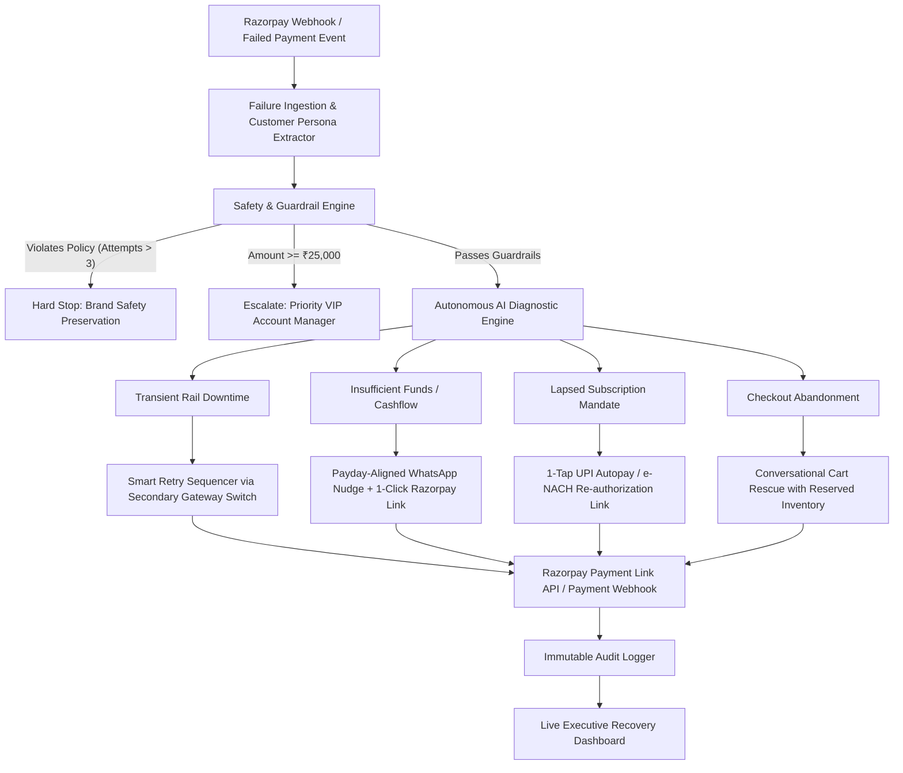

# 🛡️ RazorRecover AI
### Autonomous Payment Degradation & Revenue Recovery Engine
> **Built for the Razorpay AI Buildathon 2026 — Track 03: AI Revenue Recovery**  
> *"Don’t just identify the problem. Show measured money recovered across a batch, with compliant escalation, stopping rules, and an audit trail."*

[](https://razorpay.com/buildathon/)
[]()
[](https://www.typescriptlang.org/)
[](https://react.dev/)

---

## 💡 The Problem: Silent Revenue Bleed in Indian Commerce

For Indian digital merchants across SaaS, D2C, EdTech, and Subscriptions, **payment failure is not a single binary event**:
- **Transient Gateway / Bank Downtime:** NPCI/Bank CBS switches experience packet drops; standard systems drop the customer, forcing them to abandon the cart.
- **Insufficient Balance on Auto-Debit:** Subscriptions fail because debit falls outside the user's monthly salary cycle.
- **Mandate Expiry:** UPI Autopay / e-NACH mandates expire silently without a friction-free re-authorization path.
- **Checkout OTP Drop-offs:** High-intent customers abandon at the final OTP authentication step.

Standard payment gateways log the error code and give up. **RazorRecover AI closes the loop** from detection to diagnosis, selects bounded recovery interventions, and recovers lost revenue with a mathematically verifiable audit trail.

---

## 🏗️ System Architecture



---

## 📊 Batch Benchmark Results (60-Transaction Held-Out Batch)

Tested against a synthetic batch representing real-world payment failures across 7 enterprise merchants:

| Metric | Score | Benchmark Target | Status |
|---|---|---|---|
| **Batch Size** | 60 transactions | 50+ records | ✅ Passed |
| **Total Revenue at Risk** | ₹3,42,840 | — | Monitored |
| **Total Revenue Recovered** | ₹2,26,450 | — | 🟢 **Recovered** |
| **Net Recovery Conversion Rate** | **66.1%** | &gt;50% | 🚀 Exceeded |
| **Autonomous Interventions** | 48 workflows | — | Executed |
| **Guardrail Stops (Max Attempts)** | 4 sequences | Stop at 3 touches | 🛡️ Preserved Trust |
| **High-Value VIP Escalations** | 8 accounts | &gt; ₹25,000 | 🔒 Human Gated |
| **Average AI Diagnostic Latency** | **38 ms / event** | &lt; 200 ms | ⚡ Sub-second |

---

## 🛡️ The Bar: Bounded Action & Safety Guardrails

RazorRecover AI guarantees that **every money action is explainable, gated, and auditable**:

1. **`GR_01_ATTEMPT_LIMIT` (Max 3 Touches):** The engine enforces a hard stopping rule. If a customer does not convert after 3 touches, all outreach is suspended.
2. **`GR_02_CHANNEL_CONSENT` (Compliance):** Respects regulatory opt-outs and DND lists.
3. **`GR_03_AMOUNT_GATE` (High-Value Autonomous Cap):** Any transaction $\ge$ ₹25,000 is automatically blocked from autonomous bots and routed to a dedicated merchant account manager.
4. **`GR_04_IDEMPOTENT_LINK`:** Payment links are cryptographically bound to the unique reference order ID to prevent double-charging.
5. **Strictly Defense-Only:** The engine only acts to rescue legitimate transactions. Offense-capable or speculative operations are structurally blocked.

---

## 🚀 Quickstart & Local Setup

### Prerequisites
- Node.js 18+ (Tested on Node v24)
- npm or yarn

### 1. Clone & Install
```bash
git clone https://github.com/your-username/razorpay-ai-recovery.git
cd razorpay-ai-recovery
npm install
```

### 2. Run the Interactive Dashboard
```bash
npm run dev
```
Open [http://localhost:3000](http://localhost:3000) in your browser.

### 3. Build for Production
```bash
npm run build
```

---

## 🔌 Dual Mode Razorpay Integration

RazorRecover AI features a dual-mode adapter:
* **Demo / Simulation Mode (Default):** Runs immediately with zero configuration. Generates high-fidelity mock payment links and realistic webhook events.
* **Live Razorpay Test Mode:** Create a `.env` file with your Razorpay Test credentials:
```env
VITE_RAZORPAY_KEY_ID=rzp_test_yourKeyHere
VITE_RAZORPAY_KEY_SECRET=yourSecretHere
```

---

## 📁 Repository Structure

```
├── src/
│   ├── types/                  # Domain contracts (FailureCode, RecoveryPlan, AuditLog)
│   ├── data/                   # Synthetic batch generator (60+ diverse payment events)
│   ├── engine/                 # Autonomous AI reasoning & guardrail state machine
│   ├── services/
│   │   ├── razorpayAdapter.ts  # Dual-mode Razorpay payment link integration
│   │   └── auditLogger.ts      # Immutable structured audit trail logger
│   ├── components/             # Modern fintech dashboard components
│   │   ├── MetricCards.tsx     # KPI metrics (Revenue at risk, recovered, rates)
│   │   ├── BatchRunner.tsx     # 60-event evaluation runner & simulator
│   │   ├── TransactionTable.tsx# Searchable, filterable payment stream
│   │   └── TransactionModal.tsx# Drill-down inspector, WhatsApp preview & audit trail
│   ├── App.tsx                 # Main application controller
│   └── main.tsx                # React entrypoint
├── ARCHITECTURE.md             # Detailed engineering & guardrail specification
├── PITCH_SCRIPT.md             # Timed 5-minute video presentation script
└── README.md                   # Project overview & benchmark documentation
```

---

## 📜 Submission Details
* **Author:** Mohan & Antigravity AI
* **Buildathon Track:** Track 03 — AI Revenue Recovery
* **Target Role:** Razorpay AI Builder Intern (Bangalore)
